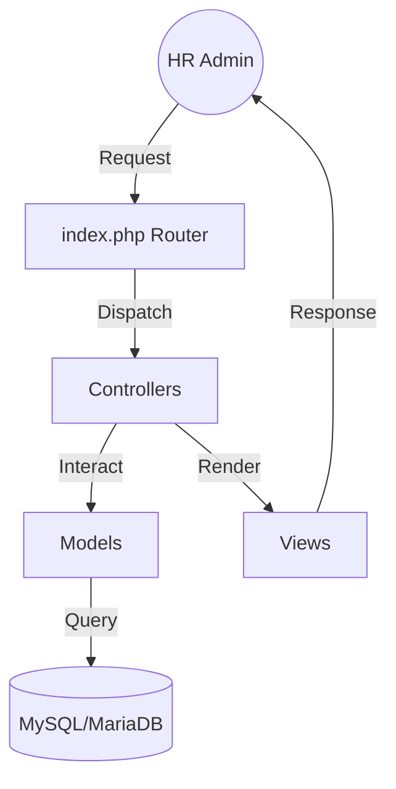

# Employee Management Web Application

[](https://www.php.net/)
[](https://www.mysql.com/)
[](https://www.docker.com/)

A professional, MVC-based PHP application designed to streamline Human Resources operations. This platform allows administrators to manage employee records, track absences, and generate official documentation with ease.

---

## Key Features

### Admin Management
- **Secure Authentication**: Multi-user login with session management.
- **Profile Customization**: Admins can update their personal information and manage credentials.
- **Admin Dashboard**: A centralized hub for quick access to all HR functions.

### Employee Management
- **Full CRUD Operations**: Create, Read, Update, and Delete employee profiles.
- **Rich Profiles**: Track detailed info including matricule, CIN, badge, CNSS, and bank details.
- **Photo Management**: Support for employee profile pictures.
- **Bulk Data Import**: Automatic CSV import functionality for quick onboarding.

### Absence Tracking
- **Leave Management**: Log and track employee absences with specific dates and types.
- **History Tracking**: Maintain a clear record of attendance for every staff member.

### Document Generation
- **Automated Attestations**: Generate professional work attestations with a single click.

---

## Architecture

The application follows the **Model-View-Controller (MVC)** architectural pattern for clean code separation and scalability.



---

## Tech Stack

- **Backend**: PHP 8.2 (Vanilla with PDO)
- **Frontend**: HTML5, CSS3, JavaScript
- **Database**: MariaDB / MySQL
- **DevOps**: Docker & Docker Compose
- **Environment**: PHP dotenv for secure configuration

---

## Project Structure

```text
├── app/
│   ├── controllers/    # Business logic & Route handlers
│   ├── models/         # Database interactions (PDO)
│   ├── views/          # Frontend templates (PHP/HTML)
│   ├── database/       # Connection & Migration scripts
│   ├── assets/         # CSS, JS, and Images
│   └── uploads/        # Storage for photos and CSVs
├── docker/             # Custom Docker configurations
├── Dockerfile          # Container definition
└── docker-compose.yml  # Multi-container orchestration
```

---

## Installation & Setup

### Method 1: Docker (Recommended)

1. **Clone the repository**:
   ```bash
   git clone <repository-url>
   cd employee-management-webapp
   ```

2. **Configure Environment**:
   - Copy `.env.example` to `.env`
   - Adjust database credentials if necessary.

3. **Start the containers**:
   ```bash
   docker-compose up -d --build
   ```

4. **Initialize Database**:
   - Navigate to `http://localhost:<APP_PORT>/database/migration.php` to run migrations and import initial data.

### Method 2: Manual Setup

1. **Prerequisites**: PHP 8.2 & MySQL/MariaDB server.
2. **Configuration**: Set up your local database and update the `.env` file.
3. **Dependencies**: Run `composer install` inside the `app/` directory.
4. **Server**: Point your web server to the `app/` directory.

---

## Database Schema

- **`admin`**: Managed credentials and profile info for HR staff.
- **`employes`**: Stores comprehensive employee data, linked via `matricule`.
- **`absences`**: Logs employee leaves with foreign key constraints to the employee table.

---

## License

Distributed under the MIT License. See `LICENSE` for more information.
